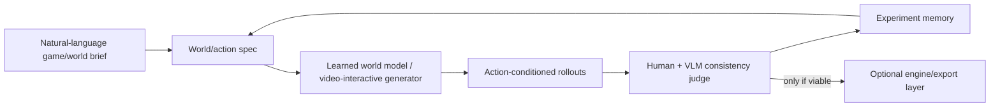

# Namoureux Genie-like Game Dev Spike — Postmortem and Pivot Notes

**Date:** 2026-05-25  
**Status:** closed / archived  
**Owner:** Thibault / Aoleon  
**Repository note:** this document keeps a durable trace of an abandoned local UE5/Unity prototyping track. The local engine installs and prototype projects were intentionally deleted after the experiment.

## Executive summary

We attempted to build a local, autonomous, scriptable 3D game-development pipeline for a stylized dream-platformer prototype, *Namoureux Dream Platformer*. The original ambition was close to a small “Genie-like” loop:

1. natural-language brief;
2. spec/candidate generation;
3. asset generation or ingestion;
4. runtime activation in an engine;
5. multi-view captures;
6. visual/gameplay/world-model scoring;
7. selection, rollback, and reporting.

The work proved valuable as a systems experiment, but the final result was not visually viable. The bottleneck was not primarily orchestration: it was the lack of strong, coherent, production-level world/character assets and the absence of a true learned world model. Local UE5/Unity scripting plus procedural or CC0/low-poly assets produced prototype/blockout visuals, not a credible final artistic slice.

Decision: **stop the UE5/Unity local-engine track, delete the heavy local installs/projects, and pivot toward a world-model-first / Google-Genie-like research direction.**

## What was built

### UE5 local automation track

A UE5 sandbox was used as the main initial runtime target. The pipeline included:

- scripted vertical slice map generation;
- clean capture mode and HUD suppression;
- generated/curated asset manifests;
- multi-view visual scoring;
- gameplay/world-model proxy scoring;
- provenance checks;
- autonomous hardening runs with scorecards and rollback policy.

Important technical outcomes:

- UE5 was scriptable enough for repeatable local automation.
- Capture and scorecard loops could be run autonomously.
- Provenance and free/OSS policy checks were feasible.
- However, UE5 content quality stayed dependent on asset quality and authoring depth.

### Free/OSS asset track

We integrated and tested free/OSS/CC0 assets, including:

- Kenney packs;
- Quaternius modular ruins;
- generated/local procedural Blender assets;
- Poly Haven CC0 textures;
- authored polish variants and A/B selection.

This improved coverage and licensing, but it did not solve the artistic coherence problem. The result remained visibly kitbashed/procedural.

### Unity visual spike

Unity was installed and driven fully through CLI/batch mode. This was used as a parallel visual testbed to determine whether UE5 itself was the bottleneck.

Key findings:

- Unity CLI rendering worked when using `-batchmode -quit`.
- `-nographics` was not viable for the capture path on macOS/Unity 6000.4.8f1 because `Camera.Render()` segfaulted without a graphics device.
- Unity was easier to iterate for quick visual experiments, but still suffered from the same asset/composition limitations.
- Image-space grading could inflate automated visual scores without producing a genuinely better scene.

### Human-alignment gate

A stricter “human-alignment” score was introduced because deterministic visual metrics overvalued color saturation, contrast, and composition proxies.

The stricter gate penalized:

- heavy post-grade dependency;
- image-space palette/depth reconstruction;
- flat cutouts or primitive maquettes;
- insufficiently authored world layout;
- raw/scored image mismatch.

This was useful: it made the automation more honest and prevented calling prototype visuals “final” or “premium.”

## What failed

### 1. Procedural/local authored assets stayed too basic

We generated local Blender meshes for:

- Namoureux/Namoureuse;
- three dogs;
- foreground dressing;
- an authored storybook world overlay.

Even with capes, crowns, hair, roots, vines, path tiles, lanterns, and richer dressing, the visual result remained procedural/blockout-like. It was better than primitives or billboards, but still not production-quality art.

### 2. CC0 packs were useful but not sufficient

Kenney/Quaternius-style assets helped with provenance and completeness, but they were too generic/low-poly to carry the desired BOTW-like/stylized dream vertical slice.

### 3. Automated scores were easy to game

Several runs achieved high visual-oracle scores through:

- strong saturation;
- depth contrast;
- post-processing;
- camera ribbons/panels;
- heuristic-friendly compositions.

But these did not align reliably with human judgment. The stricter human-alignment gate partially corrected this.

### 4. No true learned world model

The “world model” portion remained a proxy. This allowed the pipeline to proceed technically, but it did not provide the core capability expected from systems like Google Genie: learned, action-conditioned world generation/simulation from visual experience.

### 5. Local engine orchestration was not the main bottleneck

UE5 and Unity could both be automated, but neither solved the central problem: producing a coherent, high-quality, novel 3D world from a brief without a strong learned generative world model or high-quality art production assets.

## Cleanup performed

After deciding the track was not viable, the following local projects/installations were deleted:

- `/Users/thibault/Developer/UnityProjects/NamoureuxUnityVisualSpike` — about 1.8 GB;
- `/Applications/Unity/Hub/Editor/6000.4.8f1` — about 8.8 GB;
- `/Applications/Unity Hub.app` — about 420 MB;
- `/Users/thibault/Developer/UnrealProjects/UE5CodexSandbox` — about 9.8 GB;
- `/Users/Shared/Epic Games/UE_5.7` — about 37 GB.

Approximate recovered disk space: **58 GB**.

The Craft Agent session history was kept separately as lightweight trace material.

## Key lessons

1. **Do not overvalue engine automation.** Scriptable UE5/Unity is useful, but it does not create artistic quality by itself.
2. **Separate scoring from promotion.** Automated visual scores can guide iteration but should not authorize “final/premium” claims.
3. **Prefer raw-scene quality over post-graded screenshots.** Post-grade is useful for presentation, but should not hide weak world/asset authoring.
4. **Provenance is solvable; quality is not.** CC0/open assets are safe, but a coherent art-directed slice still needs either strong asset sources or a learned generator.
5. **World-model-first is the correct next research direction.** A Genie-like system needs learned video/world priors, not only procedural asset generation plus engine capture.

## Recommended pivot

The next viable direction is not another local Unity/UE pass. It should be a **Genie-like / world-model-first research track**:

- study currently available open research around generative interactive environments;
- evaluate video/world models that can generate action-conditioned rollouts;
- keep engine runtimes optional and downstream, not central;
- design a small benchmark around prompt → controllable world rollout → consistency/actionability metrics;
- only reintroduce UE/Unity if/when a generated world representation needs export, packaging, or gameplay instrumentation.

Possible next architecture:

## Final decision

The UE5/Unity local-engine prototype track is closed. The useful artifacts are the system lessons, scoring/rollback/provenance patterns, and the negative result showing that the local-engine approach does not meet the desired quality bar without a stronger learned world model or serious handcrafted asset production.

